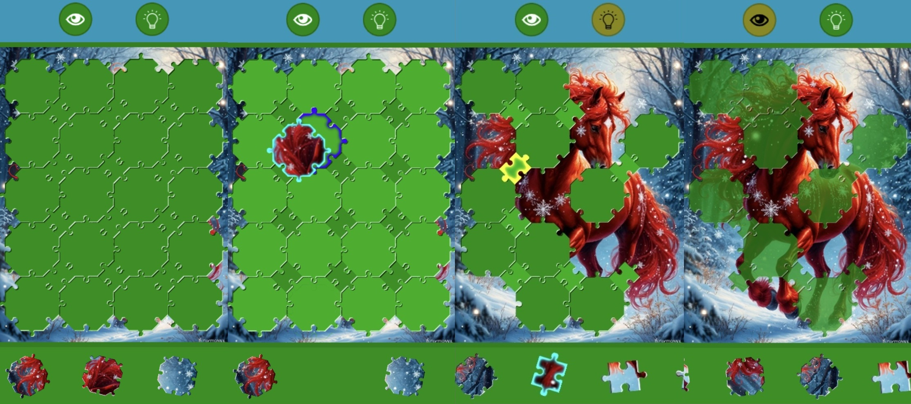

# Игра "Мозаика" (Tiling Puzzle)


## Описание
### Цель игры
Необходимо собрать изображение лошадки из отдельных фрагментов, расставив их по правильным ячейкам на игровом поле.

### Правила игры
Изначально все фрагменты картинки находятся на ленте в нижней части экрана.
Пользователь прокручивает ленту и собирает с неё фигуры.

Ячейки на игровом поле неподвижны и ждут своих фрагментов.

Игрок может:
- взять фрагмент с ленты и поместить его в подходящую по форме свободную ячейку на поле;
- вернуть фрагмент обратно на ленту, если он пока не нужен или был взят по ошибке;
- взять фрагмент из ячейки на игровом поле и переместить его в другую подходящую по форме свободную ячейку;
- вращать фигуру на одном месте.

В игре есть 2 подсказки: глазик и лампочка.
Лампочка подсказывает, в какую ячейку укладывать схваченный фрагмент.
Глазик делает ячейки полупрозрачными так, чтобы сквозь них проступала картинка.

Игра завершается, когда все ячейки заполнены правильно и картинка собрана целиком.

### Управление в игре
Игрок может:
- подбирать фигурки мышкой с зажатой левой кнопкой или пальцем на сотовом телефоне;
- увеличивать полотно колёсиком мыши или двумя пальцами;
- прокручивать полотно мышкой с зажатой правой кнопкой или двумя пальцами.
- поворачивать фигурки одинарным тапом/кликом.

### Вариативность игры
Есть три стратегии сборки картинки:
- от краёв в центр;
- от центра к краям;
- произвольная.

В игре могут быть следующие фигурки:
- треугольнички;
- квадратики;
- шестиугольники;
- восьмиугольники + квадратики.

Эти фигурки могут быть также представлены с одинарными замками, все, кроме треугольников.

## Сайт для тестирования игры
https://katekotova.github.io/tiling-puzzle/

## Доска с backlog проекта
https://katekotova.kaiten.ru/p/3f91ca19-a342-498e-8940-1321992bd9b8

## Патент на промышленный образец пазла
https://www.fips.ru/cdfi/fips.dll?ty=29&docid=00151484&ki=S

## Установка и настройка
Скачайте репозиторий.
Перейдите в папку с кодом.
К командной строке введите:

```
npm install
npm run build
npm run dev
```
## Статус проекта
Проект находится в разработке и движется к MVP.

## Контакты
Котова Екатерина Александровна,
e-mail: katekotova_86@mail.ru
