# Описание игры-мозаики

## Кнопки игрового поля
1. Бургер-кнопка - вызов меню.
Когда меню вызывается, она может превращаться к крестик.
Когда по крестику в меню нажимают, меню скрывается, а крестик превращается в бургер-кнопку.

2. Лампочка - подсказка.
Кнопка-переключатель с двумя режимами: "лампочка горит" и "лампочка не горит".
У пользователя будут бонусы для лампочки.
За то, что пользователь включает подсказку-лампочку, бонусы снимаются.
Таким образом, количество включений лампочки-подсказки ограничено количеством бонусов для лампочки.
Если лампочка включена (подсказка активирована), то когда пользователь хватает какой-то пазл, подсвечивается его целевая ячейка.
Если пользователь отпустил этот пазл или куда-то его поместил, лампочка сама отключается (то есть подсказка использована).
В режиме разработки, возможно, не будет ограничений на использование лампочки.

3. Глазик - прозрачность.
Кнопка-переключатель с двумя режимами: "глазик не видит" и "глазик видит".
Когда кнопка нажата, пользователь видит полупрозрачную картинку сквозь ячейки.
При закрытом глазике ячейки непрозрачны.
По умолчанию глазик будет закрыт.
В режиме разработки, возможно, не будет ограничений на использование глазика.
Но для релиза на глазик будут наложен ограничения: ограниченное количество раз при использовани.
У пользователя будут бонусы для глазика.
За то, что пользователь включает подсказку-глазик, бонусы снимаются.
Если глазик открыт (подсказка активирована), то картинка проступает сквозь ячейки.
Затем пользователь хватает какой-то пазл, этот момент фиксируется.
Если пользователь отпустил этот пазл или куда-то его поместил, глазик сам закрывается (то есть подсказка использована).

## Кнопки, которых не будет на игровом поле

1. Динамик - включить/выключить звук.
В игре будет весёлая музыка.
Думаю, по умолчанию музыка будет включённой.
Регулятор громкости и возможность включения/выключения лучше поместить в настройках.

2. Рублик - кнопка для донатов.
Лучше поместить эту кнопку в конце уровня в окна перепрохождения уровня и окно победы.

*Как вы думаете, такая последовательность кнопок хорошая или нет?*
*Нравятся ли вам такие кнопки вообще или нет?*

## Монетки
Монетки - это внутренняя валюта.

Монетки будут добавляться за победу.
В каждой картинке будет какое-то своё количество пазлов.
За прохождениие без подсказок будет начисляться процент от сложности пазлов в раскладке в виде монет.
Например, 40%. Так, если у раскаладке сложность 10, и пользоватль собрал без подсказок, то ему достанется 4 монетки.

За использование максимального количества лампочек будет сниматься 10%.
Если лампочки были использованы полностью, то процент снимается поменьше пропорционально.

За использование максимального количества глазиков будет сниматься 20%.
Если глазики были использованы полностью, то процент снимается поменьше пропорционально.

Также за прохождение уровня на время в 2 раза (или ругой пропорции, надо рассчитать, может, 1.5)
быстрее установленного времени будет начисляться ещё 20%.
Если пользователь прошёл в 1ю5 раза быстрее, чем нужно, начислят 10%.
Если чётко уложился во время - 0%.
то есть за оставшееся время будет начисляться процент.

За точность сборки мозаики также будут даваться монеты:
за каждый собранный с первого раза пазл будет даваться количество монет с перерасчётом на сложность пазла, нужно придумать формулу.

Можно предусмотреть другие варианты для получения монет:
- просмотр рекламы;
- покупка за реальные деньги;
- ежедневное начисление какой-то суммы.

Подсказки (глазик и лампочка) будут стоить какое-то количество монет.
Например, 5 за одно включение глазика и 3 за лампочку.

Дополнительное время будет стоить, например, 1 монета за 10 секунд.

Можно добавить различный контент за монетки:
- секретные уровни,
- музыку,
- визуальные эффекты (конфетти и т.п.),
- фон игрового поля.

*Что вы думаете по этому поводу? Это очень важный игровой момент, мне важно ваше мнение!*

## Магазин
В магазине за монетки можно будет покупать подсказки: глазики (5 монет за 1) и лампочки (3 моенты за 1),
а также время для уровней на время (10 секунд за 1 монету).
Возможно, в дальнейшем:
- секретные уровни,
- музыку,
- визуальные эффекты (конфетти и т.п.),
- фон игрового поля.

Это будет модельное окно из меню.

## Таймер и кнопка паузы
В некоторых уровнях будет учитываться время прохождения.
Поэтому предлагаю сделать таймер в виде маленького значка часов и рядом будет время мм:сс (минуты:секунды).

Когда время будет истекать, иконка часов или будильника будет звонить, нолики во поле времени - мигать и появляться сообщение,
что время истекло и вылезать окошко, запрашивающее перепрохождение уровня: "Время истекло! Попробуйте перепройти ещё раз"
и произойдёт переход в меню выбора параметров уровня.

Если учитывать монеткки как дополнительное время, то после завершения основного времени пойдёт дополнительное время.

Тут можно сделать кнопку паузы, при паузе таймер приостанавливается, появляется модальное окно паузы, которое перекрывает контент,
чтобы пользователь не подглядывал.
В окне паузы будет только кнопка: "Возобновить игру".

Если пользователь переходит в меню во время игры, то пауза времени также срабатывает, и контент тоже не виден, он перекрывается окном меню.
Когда из меню выходят, пауза снимается, если была игра на время.

Таймер и кнопка паузы будут только в уровнях на время.

*Как вы относитесь к кнопке паузы? Мне кажется, она нужна, а как вы думаете?*
*Что вы думаете про тающие бонусы в качестве дополнительного времени?*

## Лента прокрутки с кнопками
Лента прокрутки содержит пазлы, которые подбирает пользователь.
Лента прокручивается, когда пользователь захватывает её указателем в просветах между пазлами.

В начале и в конце ленты с пазлами будут кнопки прокрутки.
При нажатии на такую кнопку лента прокручивается в соответствующею сторону на величину вьюпорта.

Здесь была бы удобна полноценная полоса прокрутки с ползунком и кнопками по краям, но она будет занимать место.
Даже, если сделать только один ползунок без кнопок, будет занято дополнительное место.
Место может быть критичным, если пользователь играет на сотовом телефоне.

Саму полоску вроде бы привычно прокручивать, но не совсем удобно: малейшее движение и захватывается пазл, если указатель попал на пазл, а не на просвет между пазлами.
Поэтому по бокам полоски нужны кнопки.

*Что вы думаете по поводу полоски с кнопками? Насколько это удобно или нет по вашему опыту?*

## Расположение компонентов игрового поля
Есть 2 вида расположения компонентов: вертикальное и горизонтальное.
Но для начала сделаем только вертикальное расположение и больше будем ориентироваться на мобильную версию игры.

Последовательность расположения компонентов будет следующей.
1. В самом верху:
	- монетки: значок и количество монеток;
	- время: для уровней на время идёт назад, для других уровней идёт вперёд;
	- бургер-кнопка - вызов меню, она же - пауза.
2. Чуть ниже:
	- под времменем - дополнительное время маленькими символами, например, +1:00, будет убывать, когда прошло основное время, для уровней не на время - скрыто.
3. Кнопки-значки-подсказки:
	- глазик;
	- лампочка.
4. Чуть ниже:
	- количество доступных подсказок-глазиков;
	- количество доступных подсказок-лампочек.
5. В средине: картинка с ячейками для сборки мозаики.
6. Внизу: лента с кнопками прокрутки.

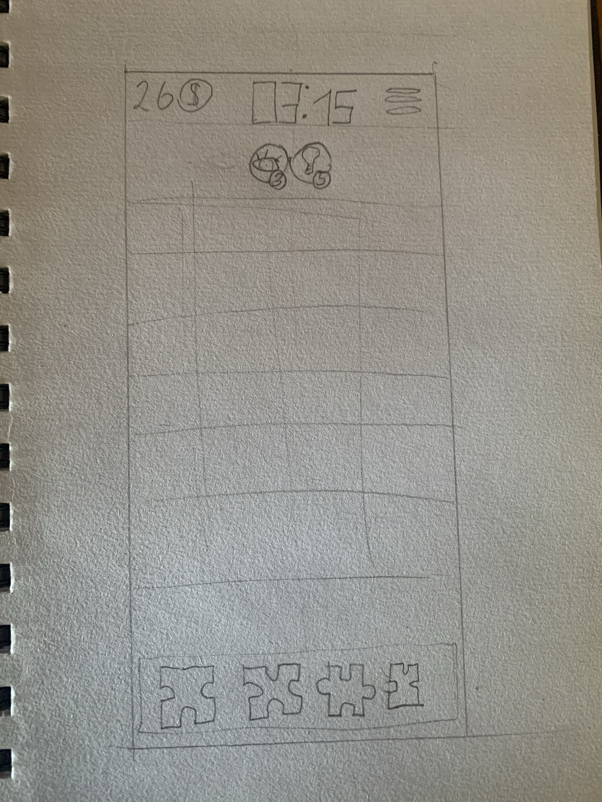

*Как вы относитесь к такому расположению компонентов?*
*Стоит ли поменять пункты 1 и 2 местами?*
*Или, может быть, вообще другая последовательность будет лучше?*

## Достижения
Если пользователь прошёл уровень до конца, он получает награду.
Для каждого уровня у награды будет какое-то своё индивидуальное название и картинка.

У достижений будет доска, это сетка с ячейками, где будут яркие заработанные достижения и блёклые - потенциальные достижения,
которые пользователь ещё не заработал.

### Уровни сложности достижений
У пользователя не будет выбора уровня сложности для прохождения.
Когда пользователь проходоит уровень впервые, уровень сложности - самый низкий.
После прохождения уровня есть возможность перепройти этот уровень ради достижений или наград, но сложность такого уровня будет выше.

Если пользователь проходит тот же самый уровень с более высоким уровнем сложности, то само достижение изменяется:
у него появляется другой цвет фона, который говорит об уровне достижения (более сложное достижение).
Также подписывается сложность уровня, который прошёл пользователь.

*Что делать, если пользователь решил пройти уровень сложностью ниже ради бонусов?*
*Может, циферки сделать сквозные для всех уровней сложности, просто сколько раз пользователь прошёл уровень на любой сложности?*

### Два дополнительных параметра достижения
У каждого достижения будет ещё 2 параметра, которые можно подписывать, например, внизу или поверх:
лучшее время и лучший процент правильно собранных пазлов с первого раза.

Для лучшего времени и лучшего процента собранных с первого раза пазлов будет вводиться поправка на сложность,
будет рассчитываться по специальной формуле.

Здесь можно указывать, при какой именно сложности достигнут данных параметр.

*Что вы думаете по поводу достижений? Хорошо ли будут смотреться уровни достижений и эти 2 параметра?*

## Разновидности уровней
В начале будут онбординговые уровни. Это уровни, в которых будет ограниченный функционал для изменений и перепрохождений, потому что пользователь только-только осваивает функции. Но в этих уровнях будут свои достижения и заработанные бонусы, которые будут учитываться, как обычно.

### Уровни на время
Здесь не будет конкретного чётко установленного времени для всех уровней.
Время для каждого уровня будет рассчитываться, исходя из сложности уровня.

Если пользователь не прошёл уровень за отведённое время, звонит будильник, выходит сообщение, что нужно перепройти уровень.

*Что вы думаете по поводу фиксированного времени для всех уровней? Или для каждого уровня время должно быть индивидуальным?*

### Уровни на точность
Здесь будет происходить подсчёт точности размещения пазлов в ячейках с первого раза.
Здесь не будет учитываться количество поворотов в ячейке, важно попадание именно в конкретную целевую ячейку с первого раза.

Для этих уровней лучше выбирать мозаика такие, где у пазлов степень свободы минимальная, даже равная одному.
Степень свободы пазла - это количество поворотов которое он может сделать в заданной ячейке, чтобы рисунок мозаики оставался прежним.
Так, у пазла привычной формы степень свободы - 2, у пазлов в виде правильных многоугольников степено свободы равна количеству сторон правильного многоугольника.

Чтобы пройти уровень, пользователь должен собрать уровень с попаданием пазлов в нужные ячейки с первого раза с процентным соотношением не менее 75%. То есть 75% пазлов должны попасть в правильные ячейки с первого раза.

Если пользователь не прошёл уровень с заданным процентом, выходит сообщение, что нужно перепройти уровень.

В качестве индикатора точности собранных пазлов можно выбрать звёздочку, например, или галочку.

*Что вы думаете про процентную величину в 75% для верного попадания пазлов с первого раза?*
*Подойдёт ли значок звёздочки для индикатора пазлов, правильно собранных с первого раза?*

### Обычные уровни
Это уровни, которые пользователь проходит в своём темпе, но при этом для достижений всё равно рассчитывается лучшее время и наибольший процент правильно собранных с первого раза пазлов, всё это с поправкой на сложность пазла.

*Что вы думаете про эти разновидности уровней?*
*Можно ли добавить какие-то ещё разновидности уровней?*

## Пункты меню
Вызов меню будет вызывать паузу в игре, если уровень идёт на время.

Пункты меню будут следующие.

1. **Настройки**. Здесь будет появляться окно настроек программы.

2. **Начать уровень заново**. Здесь будет появляться окно подтверждения: "Вы точно хотите начать уровень заново? Да Нет"

3. **Выбрать другой уровень**. Здесь будет появляться окно подтверждения: "Вы точно хотите начать другой уровень? Да Нет".
Здесь откроется карта игры с уровнями.
Пользователь сможет выбрать либо текущий вроень, либо один из тех, что были раньше, кроме уровней онбординга,
потому что перепроходить их будет слишком легко.

4. **Магазин**.

5. **Окно достижений**.

6. **Перепройти онбординг**. Здесь пользователь может снова пройти онбординг, но при этом он ничего не сможет заработать дополнительно,
чтобы он таким образом не накручивал достижения.

7. **Начать игру сначала**. Здесь будет появляться окно подтверждения: "Вы точно хотите начать игру сначала? Да Нет"
Здесь прогресс обнулится и игра начнётся сначала, включая онбординг.
Онбординговые уровни пропускать нельзя даже при начале игры заново, потому что это часть сюжета.

*Что вы думаете о таких пунктах меню? Может, что-то добавить, пересмотреть, или, наоборот, что-то не нужно?*

## Окно настроек
Здесь будет:
- полоса громкости музыки;
- кнопка для отключения музыки;
- полоса для громкости звуков в игре;
- кнопка отключения звуков в игре.

### Форма пазлов
Для каждой мозаики можно выбрать свою форму пазлов, построенную на основе базовой формы.

Виды форм пазлов бывают следующие:
- многоугольники (правильные и неправильные);
- пазлы на основе многоугольников с одинарными замками;
- пазлы на основе многоугольников с двойными замками;
- пазлы на основе многоугольников с двойными спиральными замками с хвостиками;
- пазлы на основе многоугольников с тройными спиральными замками с хвостиками;
- пазлы на основе многоугольников с двойными тройными спиральными замками;
- пазлы с разными видами спиральных замков (двойными с хвостиками, тройными с хвостиками и двойными тройными).

Для каждой мозаики может быть несколько видов из приведённых выше.

Виды пазлов буду динамически программно формироваться и отображаться.
Скорее всего, подписывать названия замков лучше не надо.

Они будут в виде картинок-кнопок, пользователь нажимает на картинку и переходит на следующий экран.
Кнопка далее не нужна, чтобы минимизировать количество кликов.

*Что вы думаете о таком визуальном выборе формы пазлов?*

### Сложность
Пользователь не может выбирать сложность сам.
При переперохождении уровня она возрастает.

Здесь можно ограничиться количеством сложностей.
Например, можно сделать всего 3 сложности для каждой мозаики, они будут формироваться программно.
Такое ограничение сделает достижения понятнее.

С другой стороны для разных форм пазлов при одинаковом количестве пазлов сложность может быть разной.

**Приведу пример**.
Допустим у нас есть квадратные пазлы, и картинка тоже - квадратная.
И здесь можно сделать, допусти, 3 сложности: 2x2, 3x3, 4x4.

По форме пазлы могут быть:

1. квадратами, степень свободы пазла: 4;

2. пазлами привычной нам формы - пазлами с одинарными замками, степень свободы пазла: 2;

3. пазлами с двойными замками, степень свободы пазла: 4;

4. пазлами с двойными спиральными замками с хвостиками, степень свободы пазла: 4.

Как вы видите, у пункта 2 степень свободы - 2, то есть сложность для этого пункта - другая.

Предлагаю форму пазла фиксировать для каждого уровня или менять в зависимости от сложности.

Пусть останется по 1 варианту формы пазла для каждого уровня.

Внизу окна будет просто кнопка - играть, и сразу переход в игру.

*Что вы думаете по поводу отображения сложностей в достижениях?*
*Что вы можете предложить ещё по поводу сложностей?*

## Окно выбора уровня
Будет содержать карту игры.
Её можно оформить, как дорогу или как железную извилистую дорогу, но можно просто сделать сетку с клетками.

Будут открытые и неоткрытые уровни.
Уровень будет иметь маленькую картинку и подпись, но можно и без подписи.
Внизу будут кнопки листания эранов уровней: вперёд и назад.

По умолчанию мы находимся на экране с текущим уровнем.
Уровни онбординга отмечены особым образом. Они будут сгруппированы.

Если кликнуть по уровню, то сразу будет переход в окно выбора сложности игры, и вообще это будет выглядеть всё, как одно диалоговое окно с меняющимися экранчиками.

Онбординг можно перепроходить целиком или по одному уровню, причём дополнительных бонусов за это не будет.
Достижение за онбординговый уровень можно получить только в первый его проход.

*Что вы думаете про это окно выбора уровня и, в частности, про онбординг?*

## Окончание игры
Пользователю показывается модальное окошко с достижением.
Здесь же можно сделать кнопки:
- дальше;
- перепройти уровень с другой сложностью;
- выбрать другой уровень;
- перейти в достижения;
- рублик - кнопка для донатов.

*Что вы думаете про такое большое количество кнопок в этом окне?*
*Какие кнопки нужны, а какие - нет, как вы думаете?*

## Уровни онбординга
### 1. Знакомство с динамиком и лентой прокрутки
**Мозаика**: фигуры на основе шестиугольников с одинарными замками, 2x2, 4 штуки, степень свободы каждого пазла - 1, сделаю так, что крутить их не надо будет, они будут сразу под правильным углом поворота.

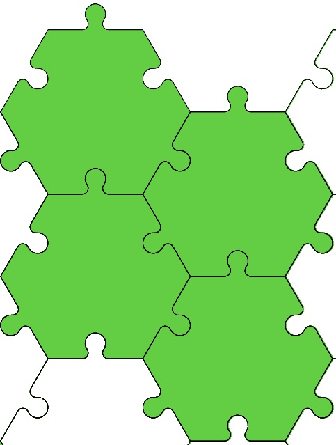

Будет дана **информация**, что:
- все звуки можно отключить кнопкой динами и поменять настройки в меню;
- лента прокручивается указателем и кнопками.

**Достижение в конце уровня**: просто картинка красивая с подписью достижения:
- без количества пройдённых раз;
- без сложности;
- со временем, затраченным на уровень;
- без правильных пазлов, собранных с первого раза.

### 2. Поворот пазла
**Мозаика**: фигуры на основе квадратов с одинарными замками, 3x3, 9 штук, степень свободы каждого пазла - 2.

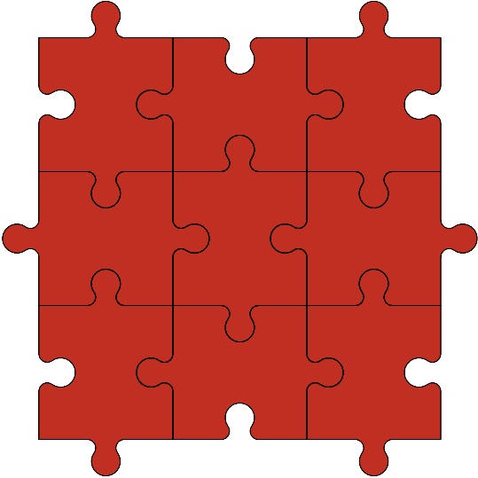

Будет дана **информация**, что пазлы можно крутить одним кликом.

**Достижение в конце уровня**: просто картинка красивая с подписью достижения:
- без количества пройдённых раз;
- без сложности;
- со временем, затраченным на уровень;
- без правильных пазлов, собранных с первого раза.

### 3. Кнопка глазик-регулятор прозрачности картинки
**Мозаика**: фигуры на основе треугольников с двойными спиральными замками с хвостиками, 4x3, 12 штук, степень свободы каждого пазла - 3.

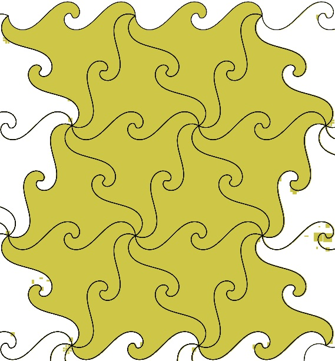

Будет дана **информация**, что пазлы можно делать ячейки полупрозрачными, чтобы разглядеть картинку под ними, с помощью кнопки-глазика.

**Достижение в конце уровня**: просто картинка красивая с подписью достижения:
- без количества пройдённых раз;
- без сложности;
- со временем, затраченным на уровень;
- без правильных пазлов, собранных с первого раза.

### 4. Подсказка-лампочка
**Мозаика** - каирская пятиугольная мозаика: фигуры на основе пятиугольников-C-планигонов, 4 блока по 4 штуки, общее количество: 16 штук, степень свободы каждого пазла - 1.

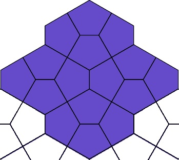

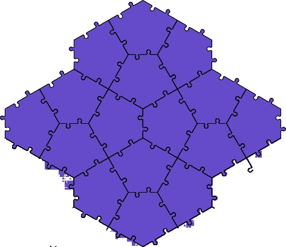

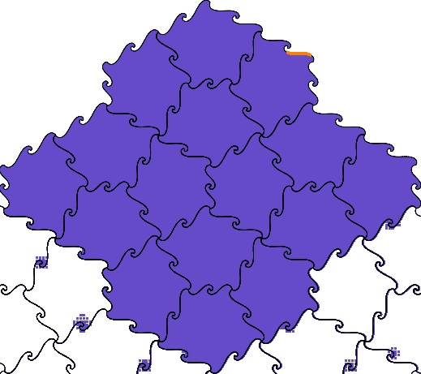

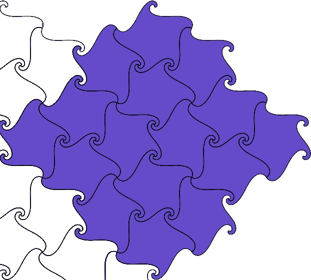

Будет какой-то из этих вариантов:
- пятиугольники-C-планигоны;
- фигуры на основе пятиугольных C-планигонов с двойными замками;
- фигуры на основе пятиугольных C-планигонов с двойными спиральными замками с хвостиками;
- фигуры на основе пятиугольных C-планигонов с разными тройными спиральными замками.

Будет дана следующая **информация**:
- будет показана подсказка-лампочка;
- будут даны бонусы на расходование подсказок.

**Достижение в конце уровня**: просто картинка красивая с подписью достижения:
- без количества пройдённых раз;
- без сложности;
- со временем, затраченным на уровень;
- без правильных пазлов, собранных с первого раза.

### 5. Игра на точность
**Мозаика** - усечённая каирская пятиугольная мозаика: фигуры на основе семиугольников и квадратов, общее количество: 28 штук, степень свободы каждого семиугольника - 1, у квадрата - это либо 2, либо 4.

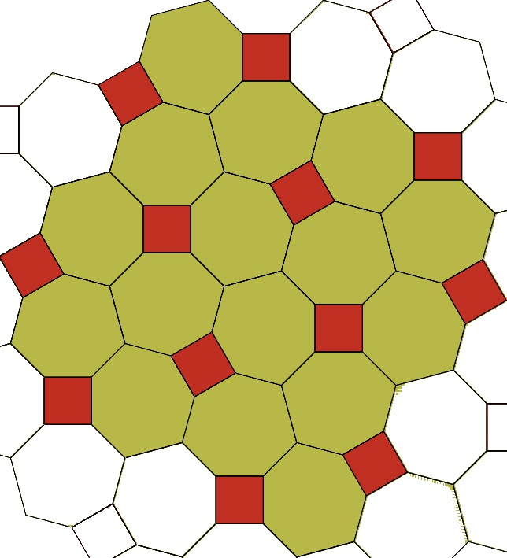

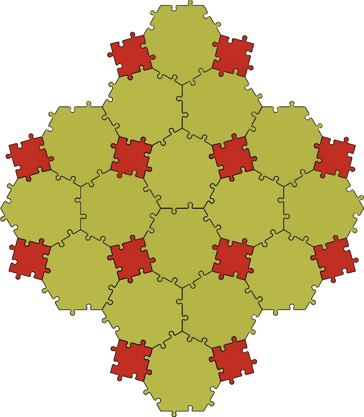

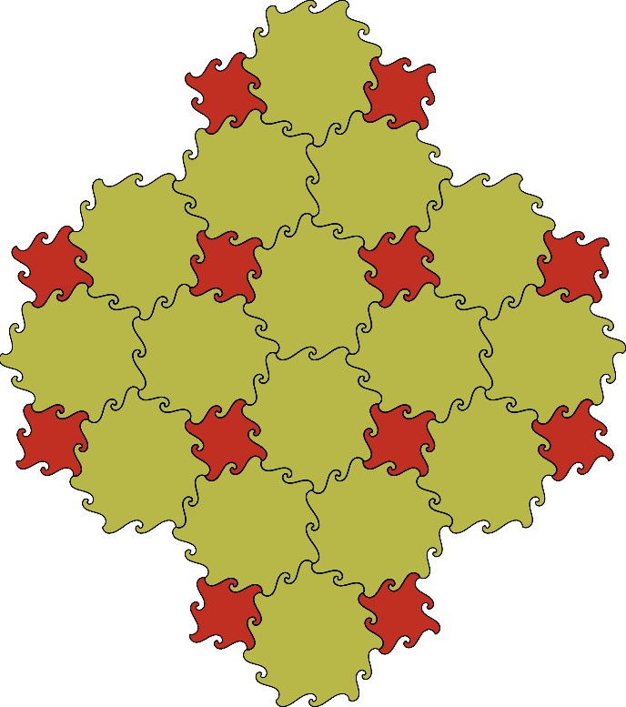

Будет какой-то из этих вариантов:
- правильные многоугольники;
- фигуры на основе правильных многоугольников с двойными замками;
- фигуры на основе правильных многоугольников с двойными спиральными замками с хвостиками.

Будет дана следующая **информация**:
- будут объяснены правила точности попадания пазлов с первого раза с нужные ячейки;
- появится индикатор правильного собранных с первого раза пазлов, например, звёздочка.

**Достижение в конце уровня**: просто картинка красивая с подписью достижения:
- без количества пройдённых раз;
- без сложности;
- со временем, затраченным на уровень;
- с количеством правильных пазлов, собранных с первого раза.

### 6. Игра на время
**Мозаика**: фигуры на основе пятиугольников-F-планигонов, 4 блока по 6 штук, общее количество: 24 штуки, степень свободы каждого пазла - 1.

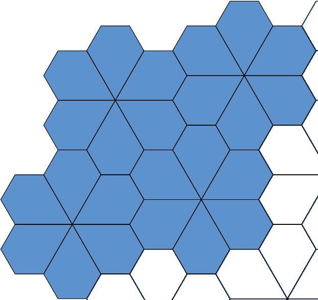

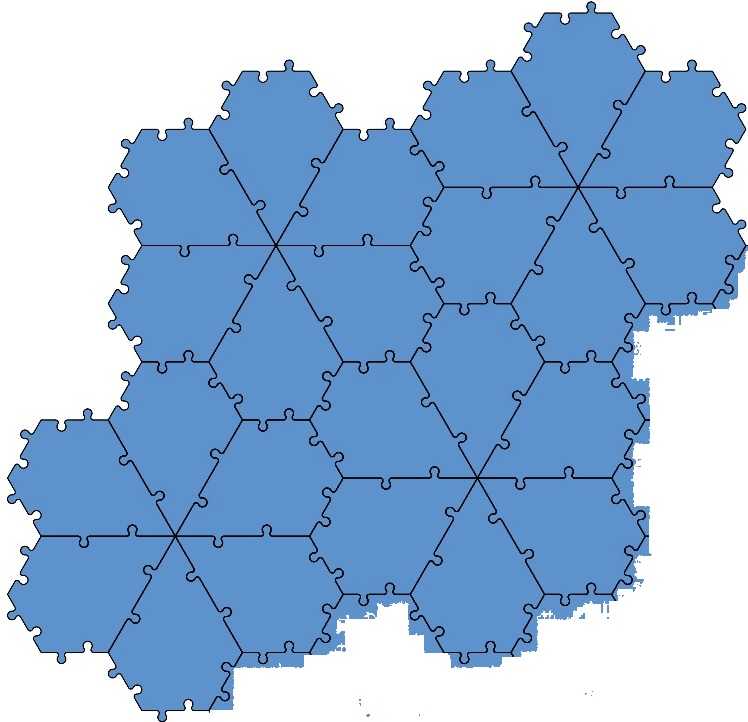

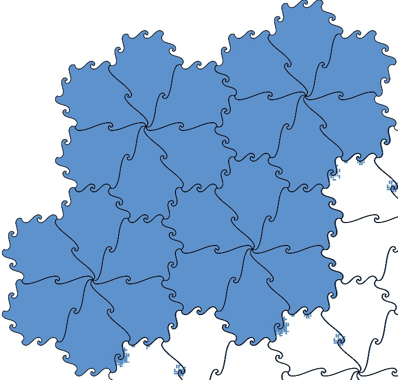

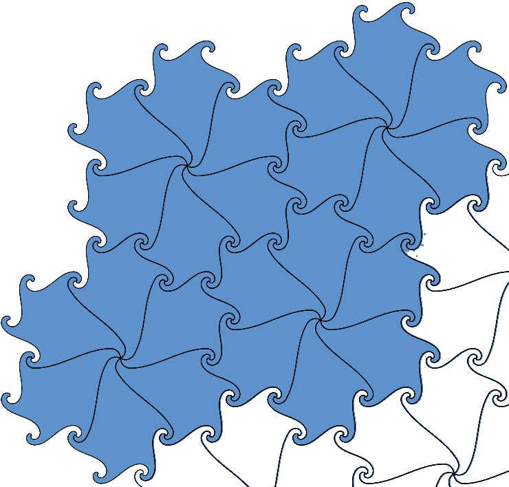

Будет какой-то из вариантов на картинках.

Будет дана следующая **информация**:
- пользователю будут даны бонусы, которые он может расходовать на подсказки-глазики и на время;
- будет показан будильник (или полоса прокрутки времени);
- время игры, которое увеличивается, будет заменено на время, которое уменьшается;
- появится кнопка паузы;
- будет объяснён механизм применения бонусов в контексте времени;
- будет объяснёно истекающее время;
- будет объяснена пауза в игре.

**Достижение в конце уровня**: просто картинка красивая с подписью достижения:
- без количества пройдённых раз;
- без сложности;
- со временем, затраченным на уровень (не оставшимся от таймера, а именно временем прохождения уровня);
- с количеством правильных пазлов, собранных с первого раза.

### 7. Сложность игры
**Мозаика**: фигуры на основе правильных шестиугольников, 2x2 или 3x3, или 4x4, общее количество: 4 или 9, или 16 штук, степень свободы каждого пазла - от 1, 3 или 6.

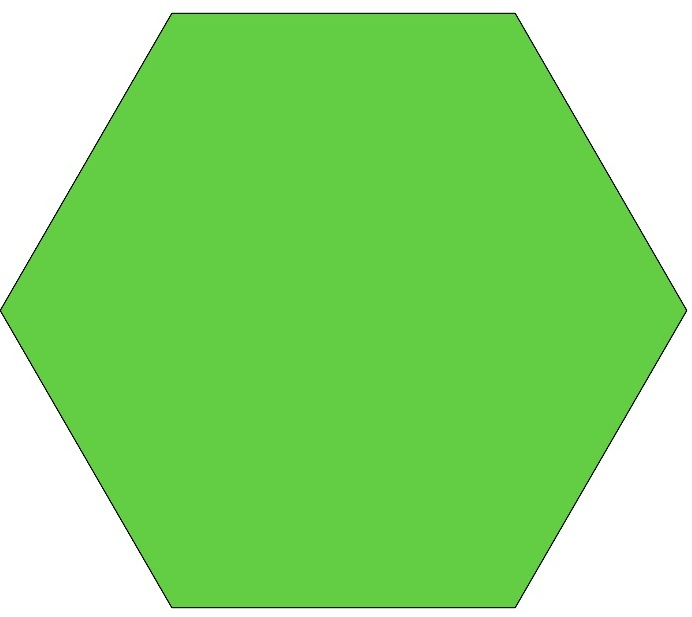

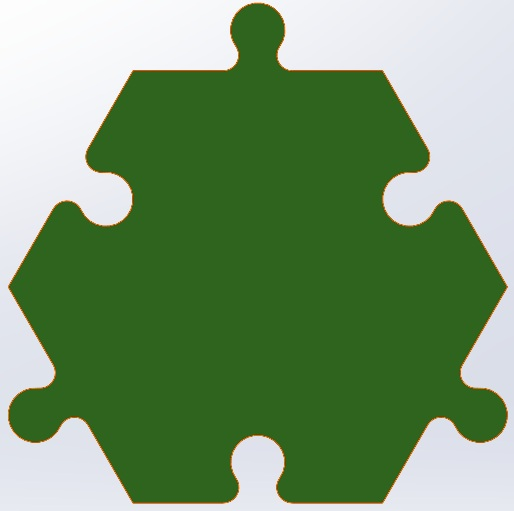

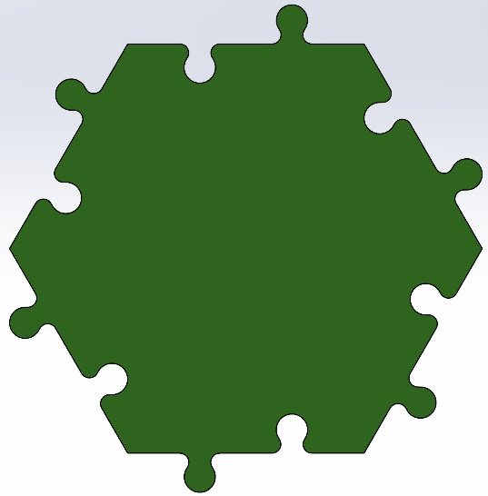

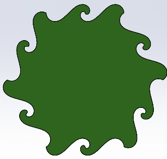

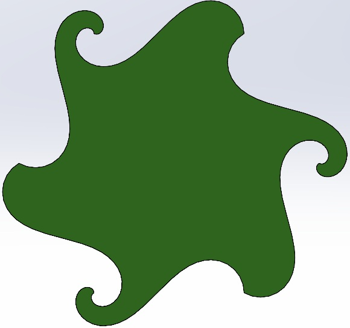

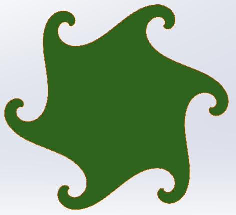

Будет какой-то из вариантов на картинках.

Будет дана следующая **информация**:
- говорится, что можно пройти уровень на другом уровне сложности, выбрав его из меню;
- в меню появляются пункты: **Выбрать другую сложность уровня** и **Выбрать другой уровень**;
- здесь появляется цвет уровня сложности достижения;
- в конце игры в меню победителя появляется кнопка пройти другой уровень, выбрать другую сложность и дальше.

**Достижение в конце уровня**: просто картинка красивая с подписью достижения:
- с количеством пройдённых раз;
- с подсветкой сложности и её уровнем, посчитанным по формуле;
- со временем, затраченным на уровень (не оставшимся от таймера, а именно временем прохождения уровня);
- с количеством правильных пазлов, собранных с первого раза.

### 8. Панорамирование и зум
**Мозаика**: фигуры на основе правильных фосьмиугольников и квадратов, 2x2 или 3x3, или 4x4 восьмиугольника (квадраты тут не посчитаны), общее количество восьмиугольников и квадратов: 5 или 13, или 25 штук, степень свободы восьмиугольников: 4 или 8, степень свободы квадратов: 2 или 4.

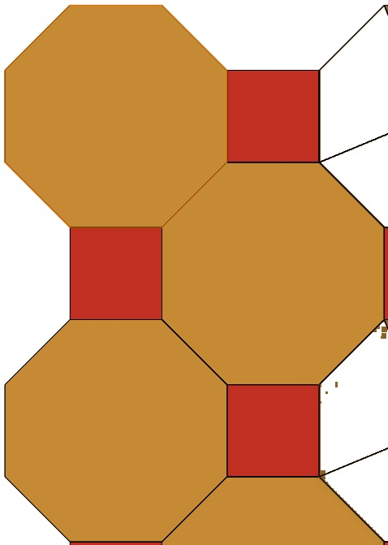

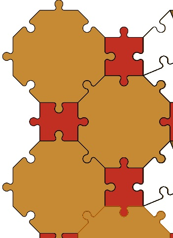

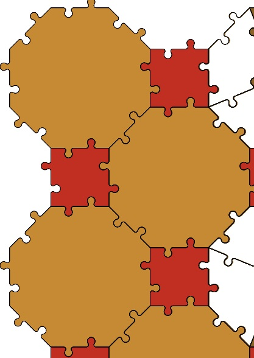

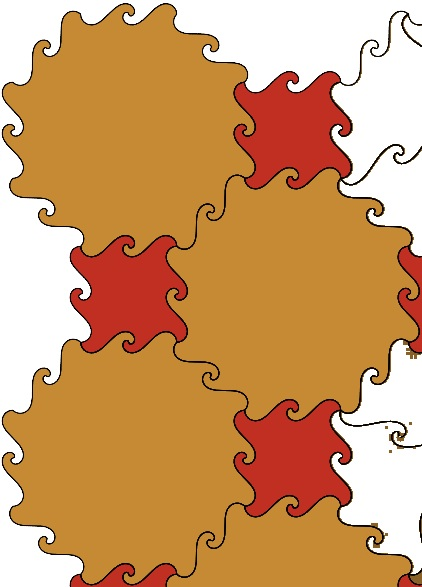

Будет дана следующая **информация**:
- зум и панорамирование рабочей области пальцами на сотовом телефоне и колёсиком и правой кнопкой мыши.

**Достижение в конце уровня**: просто картинка красивая с подписью достижения:
- с количеством пройдённых раз;
- с подсветкой сложности и её уровнем, посчитанным по формуле;
- со временем, затраченным на уровень;
- с количеством правильных пазлов, собранных с первого раза.

*Это только онбординг, а тут уже куча вариантов замощений с выбором форм фигур, мне кажется, для меня это будет очень долго делать.*
*Как бы вы поступили на моём месте? Стали бы делать столько вариантов, чтобы пользователь выбирал, или надо оставить по одному варианту на каждый уровень?*
*Если нужно оставить по одному варианту, то какие варианты вам больше всего нравятся для каждого уровня?*
*Как вы видите, я создала пазлы с причудливыми краями (со спиральными замками на сторонах и углах).*

Остальные уровни будут чередоваться: с учётом времени, с акцентом на точность и обычные уровни.

## План каждого уровня
1. Сюжетное мини-вступление. Кнопка перехода дальше.
2. Выбор формы пазла и сразу переход дальше. Если это онбординг, то на некоторых уровнях такого нет.
3. Выбор сложности пазла. Кнопка перехода к игре. Если это онбординг, то на некоторых уровнях такого нет.
5. Элементы онбординга, которые объясняют, что делать, если это уровень онбординга.
4. Сама игра.
5. Завершение уровня:
    - или достижение с возможностью перехода дальше, перед достижением мжно оживить картинку небольшим видео, например, птичка оживает, чирикает и улетает;
    - или предложение перепройти уровень.
6. Если это был последний уровень, то показывается фрагмент завершения истории и кнопки "Перепройти игру", "Посмотреть достижения".

*Как вы относитесь к такому плану игры?*